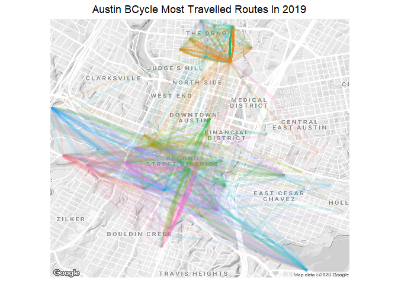

We will use the gps data provided for bike kiosks and the trip data to map out popular kiosk pairs that are travelled to and from. The darker shaded routes are more heavily travelled.


```r
library(lubridate)
library(ggplot2)
library(dplyr)
library(data.table)
library(ggrepel)
library(tidyverse)
library(devtools)
library(ggmap)
devtools::install_github("dkahle/ggmap", ref = "tidyup")

# Read in data
top_trips <- read.csv(file = "top_trip_counts_df.csv")
```


```r
# Filter out trips that start and end in the same kiosk
top_trips <- top_trips %>% filter(!(checkout_lat == return_lat & checkout_long == return_long))

# Enter API credentials 
register_google(key = Sys.getenv("GOOGLE_MAP_API"))
# google map styling
style1 <- c(feature = "all", element = "labels", visibility = "off")
style2 <- c("&style=", feature = "administrative.neighborhood", element = "labels", visibility = "on")

# Build base google map
p <- ggmap(get_googlemap(center = c(lon = -97.7431, lat = 30.2672),
zoom = 14,
scale = 2,
maptype ='terrain',
color = 'bw',
style=c(style1, style2)))
```

```
## Source : https://maps.googleapis.com/maps/api/staticmap?center=30.2672,-97.7431&zoom=14&size=640x640&scale=2&maptype=terrain&style=feature:all%7Celement:labels%7Cvisibility:off%7C:&style=%7Cfeature:administrative.neighborhood%7Celement:labels%7Cvisibility:on&key=xxx
```

```r
p + 
  geom_curve(data = top_trips, 
             aes(x = checkout_long, y = checkout_lat, 
                 xend = return_long, yend = return_lat, 
                 color=checkout_kiosk, 
                 alpha=trip_count),
             curvature=.1,   # add curvature so back and forth routes are visible between 2 points
             size = 1.5) + 
  coord_equal() +
  theme(legend.position = "none",
        plot.title = element_text(hjust = 0.5), 
        axis.title.x=element_blank(),
        axis.text.x=element_blank(),
        axis.ticks.x=element_blank(),
        axis.title.y=element_blank(),
        axis.text.y=element_blank(),
        axis.ticks.y=element_blank()) +
  ggtitle("Austin BCycle Most Travelled Routes In 2019")
```

```
## Coordinate system already present. Adding new coordinate system, which will replace the existing one.
```

```
## Warning: Removed 91 rows containing missing values (geom_curve).
```

<!-- -->
