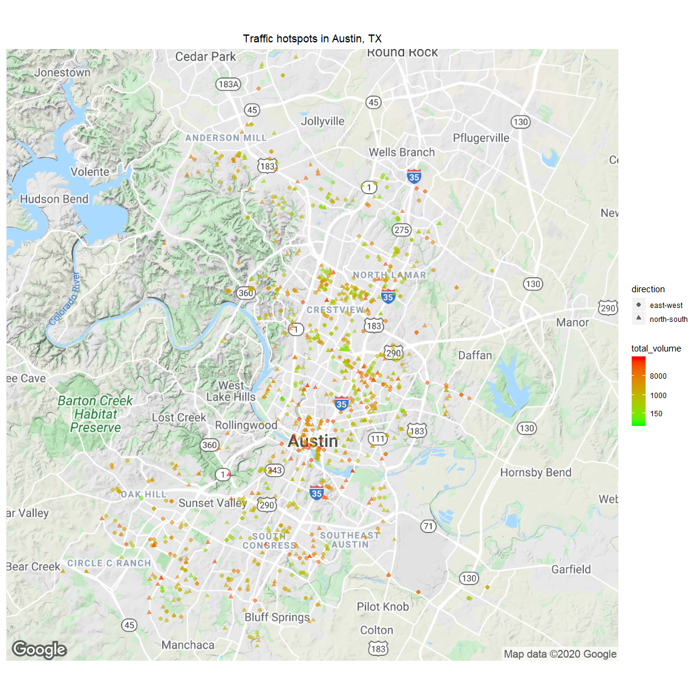

Austin Traffic Hotspots
================

We have been given raw traffic data collected by the city and asked to
provide a visual representation that shows traffic hotspots and
direction of flow.

``` r
library(RJSONIO)
library(RCurl)
library(RJSONIO)
library(plyr)
library(tidyverse)
library(lubridate)
library("ggmap")  

traffic <- read_csv("Traffic_Count_Study_area.csv")

# clean column names
traffic <- as.data.frame(traffic) %>% dplyr::rename(location = '24 HOUR VOLUME COUNT LOCATIONS',
                                             northbound = 'NB TOTAL',
                                             southbound = 'SB TOTAL',
                                             eastbound = 'EB TOTAL',
                                             westbound = 'WB TOTOAL',
                                             total_volume = 'TOTAL VOLUME',
                                             date = DATE)

# Remove time since it is midnight for all entries, convert to date
traffic$date <- gsub(" .*", "", traffic$date)
traffic <- traffic %>% 
              mutate(date = mdy(date)) 

traffic$date <- as.Date(traffic$date)

# Data ranges from 2001 - 2015
traffic %>%   summarise(min = min(date),
                        max = max(date))
```

    ##          min        max
    ## 1 2001-01-04 2015-03-31

``` r
# Filter date range to only include dates since 1/1/2010
traffic <- traffic %>% filter(date >= as.Date("2010/01/01"))
nrow(traffic)
```

    ## [1] 976

``` r
# Remove extra location info
traffic$location <- gsub(" - .*","", traffic$location)

# Add column for shows east-west or north south traffic flow
traffic$direction <- ifelse(is.na(traffic$eastbound) | is.na(traffic$westbound), 'north-south', 'east-west')

# Locate GPS coordinates of location
api_key = Sys.getenv("GOOGLE_MAP_API")


# Convert location into url with api
url <- function(location, return.call = "json") {
  root <- "https://maps.googleapis.com/maps/api/geocode/"
  location <- paste(location, 'Austin', 'TX', sep = ", ") 
  location <- gsub(" ", "+", location)
  u <- paste(root, return.call, "?address=", location, "&key=", api_key, sep = "")
  return(URLencode(u))
}

# Get location info 
geoCode <- function(location,verbose=FALSE) {
  if(verbose) cat(location,"\n")
  u <- url(location)
  doc <- getURL(u)
  x <- fromJSON(doc,simplify = FALSE)
  if(x$status=="OK") {
    lat <- x$results[[1]]$geometry$location$lat
    lng <- x$results[[1]]$geometry$location$lng
    location_type  <- x$results[[1]]$geometry$location_type
    formatted_address  <- x$results[[1]]$formatted_address
    return(c(lat, lng, location_type, formatted_address))
    Sys.sleep(.5)
  } else {
    print(x$status)
    return(c(NA,NA,NA, NA))
  }
}

# Get gps coords in chunks, otherwise API is overloaded and fails
for (x in seq(1, nrow(traffic), 50)) {
  if (x == 951) {
    traffic[x:nrow(traffic), 'latitude'] <- apply(traffic[x:(nrow(traffic)),]['location'], 1, geoCode)[1,]
    traffic[x:nrow(traffic), 'longitude'] <- apply(traffic[x:(nrow(traffic)),]['location'], 1, geoCode)[2,]
  } 
  else {
    traffic[x:(x+49), 'latitude'] <- apply(traffic[x:(x+49),]['location'], 1, geoCode)[1,]
    traffic[x:(x+49), 'longitude'] <- apply(traffic[x:(x+49),]['location'], 1, geoCode)[2,]
  }
  Sys.sleep(10)
}

traffic$latitude <- as.numeric(traffic$latitude)
traffic$longitude <- as.numeric(traffic$longitude)

# plot coordinates
# Set API Key
ggmap::register_google(key = Sys.getenv("GOOGLE_MAP_API"))

# set up base map
p <- ggmap(get_googlemap(center = c(lon = -97.7431, lat = 30.32),
                         zoom = 11, scale = 2,
                         maptype ='terrain',
                         color = 'color'))

# Add coordinates to base map
p + geom_point(aes(x = longitude, y = latitude, color = total_volume, shape = direction), data = traffic, size = 2, alpha = .6) +
  ggtitle("Traffic hotspots in Austin, TX") + 
  theme(plot.title = element_text(hjust = 0.5),
        axis.title.x=element_blank(), 
        axis.text.x=element_blank(),
        axis.ticks.x=element_blank(), 
        axis.title.y=element_blank(), 
        axis.text.y=element_blank(),
        axis.ticks.y=element_blank()) + 
  scale_color_gradient(low = "green",high = "red",  trans='log', breaks = c(150, 1000, 8000)) 
```

<!-- -->

Note the total\_volume gradient scale is log based. Unsurprisingly, we
see high activity in downtown Austin, which is an obvious constant
battle. We also see other deep red markers scattered around town in less
conspicuous areas. Alleviating these high traffic areas could have a
significant impact. We can produce a list of these hot spots to assess
(more than 8000 cars per day).

``` r
traffic %>% filter(total_volume > 8000) %>% select(location) %>% unique() 
```

    ##                                                                location
    ## 1                                                 11th St West, 200 blk
    ## 2                                                12th St East, 1300 blk
    ## 3                                                 15th St East, 600 blk
    ## 4                                                15th St West, 1100 blk
    ## 5                                             1st Street South, 100 blk
    ## 6                                                51st St East, 1200 blk
    ## 7                                                51st St East, 1400 blk
    ## 8                                                51st St East, 1600 blk
    ## 9                                                51st St East, 1700 blk
    ## 10                                               51st St East, 2100 blk
    ## 12                                               51st St East, 2900 blk
    ## 13                                                51st St East, 900 blk
    ## 14                                                5th St West, 1100 blk
    ## 15                                                 5th St West, 700 blk
    ## 16                                                 6th St East, 700 blk
    ## 17                                               Airport Blvd, 3900 blk
    ## 18                                               Airport Blvd, 4300 blk
    ## 19                                                Airport Blvd, 800 blk
    ## 20                              Balcones Dr, 5700 blk, North of RM 2222
    ## 21                    Barbara Jordan, (East of IH 35 East Service Road)
    ## 22                                          Barton Springs Rd, 2000 blk
    ## 23                                           Barton Springs Rd, 900 blk
    ## 24                                                 Berkman Dr, 5100 blk
    ## 29                                                 Berkman Dr, 5500 blk
    ## 30                                                 Berkman Dr, 6300 blk
    ## 31                                           Bluff Springs Rd, 7400 blk
    ## 32                                           Bluff Springs Rd, 7500 blk
    ## 33                                                 Brodie Ln, 10100 blk
    ## 35                                                 Brodie Ln, 10600 blk
    ## 36                                                 Brodie Ln, 11800 blk
    ## 37                                                 Brodie Ln, 12600 blk
    ## 38                                               Burleson Rd, 10000 blk
    ## 40                                                Burleson Rd, 8400 blk
    ## 42                                                  Burnet Rd, 7700 blk
    ## 44                                                  Burnet Rd, 8800 blk
    ## 45                                                 Cameron Rd, 5100 blk
    ## 46                                                 Cameron Rd, 5400 blk
    ## 47                                   Cameron Rd, 5400 blk, at Corona Dr
    ## 48                                                 Cameron Rd, 5500 blk
    ## 49                                       Cesar Chavez St East, 1000 blk
    ## 50                                       Cesar Chavez St East, 2500 blk
    ## 51                                        Cesar Chavez St East, 600 blk
    ## 52                     Cesar Chavez St W, 100 blk, West of Congress Ave
    ## 53                   Cesar Chavez St W, 700 blk, West of San Antonio St
    ## 55                                        Cesar Chavez St West, 700 blk
    ## 56                  Congress Ave S., 5900 blk, South of Little Texas Ln
    ## 57           Congress Ave S., on the Bridge, North of Barton Springs Rd
    ## 58                                         Congress Ave South, 1200 blk
    ## 59                                              Cross Park Dr, 8300 blk
    ## 61                                                 Davis Lane, 4500 blk
    ## 62                                                   Davis Ln, 3700 blk
    ## 63                                                   Davis Ln, 4500 blk
    ## 65                                Davis Ln, 4500 blk, West of Copano Dr
    ## 66                                 Davis Ln, 4900 blk, East of Latta Dr
    ## 67                                                   Davis Ln, 7700 blk
    ## 68                         Dean Keeton St E, 1300 blk, at Lafayette Ave
    ## 69                                                    Deer Ln, 4000 blk
    ## 70                          Dittmar Rd W, 1800 blk, East of Manchaca Rd
    ## 71                                              Far West Blvd, 3400 blk
    ## 72                                              Far West Blvd, 3900 blk
    ## 73                                        FM 969 (E MLK Blvd), 7400 blk
    ## 74                                                Guadalupe St, 100 blk
    ## 75                                               Guadalupe St, 3200 blk
    ## 76                                             Howard Ln West, 1000 blk
    ## 77                                              Howard Ln West, 600 blk
    ## 78                                             Lakeline Blvd, 10200 blk
    ## 79                                            Lamar Blvd North, 100 blk
    ## 80                                          Lamar Blvd North, 10600 blk
    ## 81                                          Lamar Blvd North, 12500 blk
    ## 82                                           Lamar Blvd North, 2400 blk
    ## 83                                           Lamar Blvd North, 2800 blk
    ## 84                                           Lamar Blvd North, 3100 blk
    ## 86                                           Lamar Blvd North, 5400 blk
    ## 87                                           Lamar Blvd North, 8600 blk
    ## 88                                           Lamar Blvd North, 9700 blk
    ## 89                                           Lamar Blvd South, 2200 blk
    ## 90                                            Lamar Blvd South, 300 blk
    ## 91                                               Lancaster Dr, 5000 blk
    ## 92                                                  Lavaca St, 1300 blk
    ## 93                                                   Loop 360, 2900 blk
    ## 94                                                  Loyola Ln, 5500 blk
    ## 95                                                  Loyola Ln, 6700 blk
    ## 96                                                  Loyola Ln, 7800 blk
    ## 98                                                  Loyola Ln, 8400 blk
    ## 99                                                Manchaca Rd, 4000 blk
    ## 100                                               Manchaca Rd, 8100 blk
    ## 101                                                  Manor Rd, 2600 blk
    ## 102                                                  Manor Rd, 3700 blk
    ## 103                                                  Manor Rd, 5200 blk
    ## 104                                                  Manor Rd, 5700 blk
    ## 106                            Martin Luther King Jr Blvd East, 600 blk
    ## 107                                                   Mesa Dr, 7200 blk
    ## 108                                             Montopolis Dr, 1400 blk
    ## 109                                             Montopolis Dr, 1600 blk
    ## 110                                            Oltorf St East, 1900 blk
    ## 111                                            Oltorf St East, 2000 blk
    ## 112                                            Oltorf St East, 2100 blk
    ## 113                                      Pleasant Valley Rd So, 100 blk
    ## 114                                     Pleasant Valley Rd So, 1100 blk
    ## 115                                     Pleasant Valley Rd So, 1600 blk
    ## 116                                      Pleasant Valley Rd So, 600 blk
    ## 117                                       Pleasant Valley Rd So, 90 blk
    ## 118                                   Pleasant Valley Rd South, 100 blk
    ## 119                                   Pleasant Valley Rd South, 600 blk
    ## 120                                         Riata Trace Pkwy, 12100 blk
    ## 121 Riata Trace Pkwy, 12300 blk -West of Alameda Trace Cir (E location)
    ## 122                                         Riata Trace Pkwy, 12600 blk
    ## 123                                          Riverside Dr East, 300 blk
    ## 124                                                 Rutland Dr, 900 blk
    ## 125                                          Slaughter Ln East, 700 blk
    ## 126                                         Slaughter Ln. East, 100 blk
    ## 127                                        Slaughter Ln. East, 9300 blk
    ## 128                                        Slaughter Ln. West, 5800 blk
    ## 129                                              South 1st St, 9600 blk
    ## 130                                      Spicewood Springs Rd, 8300 blk
    ## 131                                             St. Elmo East, 3000 blk
    ## 132                                         St. Johns Ave East, 500 blk
    ## 133                     Stassney Ln East, 1900 blk- West of Ponciana Dr
    ## 134                Stassney Ln East, 2400 blk- West of Pepper Tree Pkwy
    ## 135                   Stassney Ln East, 4400 blk- East of Chaparral Trl
    ## 136                     Stassney Ln East, 4800 blk- East of Two Iron St
    ## 137                    Stassney Ln East, 5400 blk- East of Walnut Grove
    ## 138                            Steck Ave, 3100 blk- West of Daleview Dr
    ## 139                                                   Todd Ln, 4100 blk
    ## 140                                          Walsh Tarlton Ln, 1300 blk
    ## 141                                          Walsh Tarlton Ln, 2400 blk
    ## 142                                            West Gate Blvd, 4600 blk
    ## 143                                            West Gate Blvd, 7300 blk
    ## 144                                             Yager Ln East, 1000 blk
