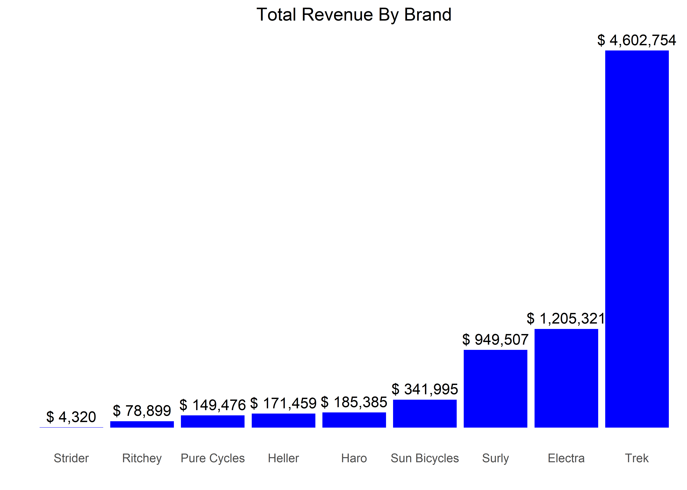
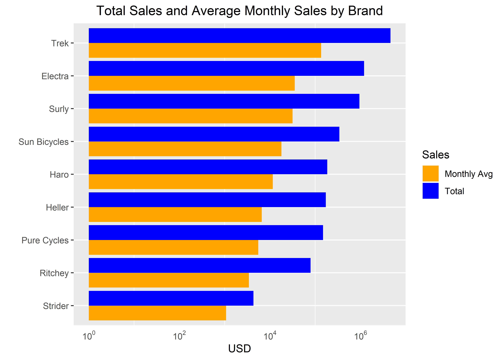
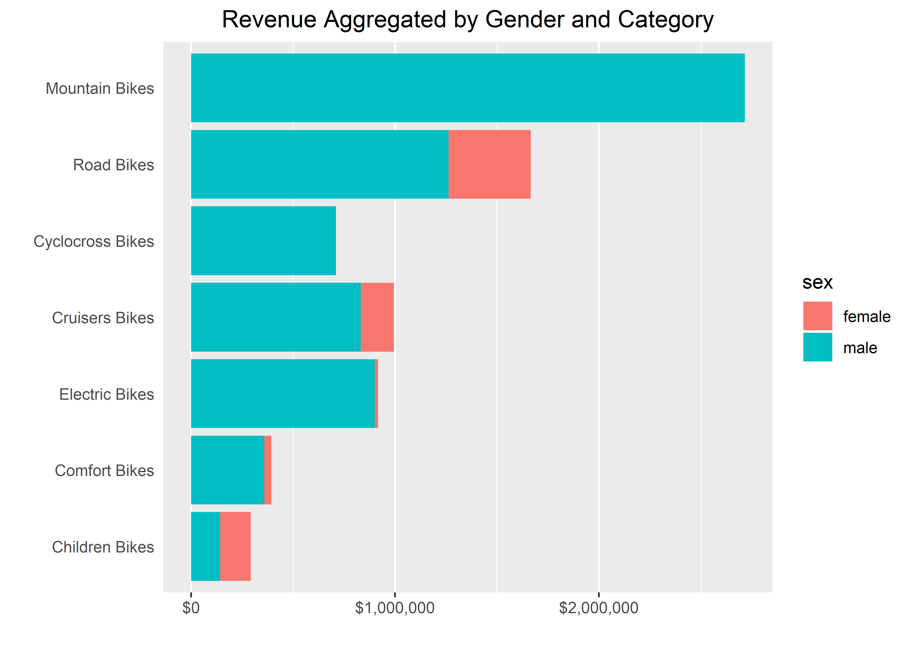
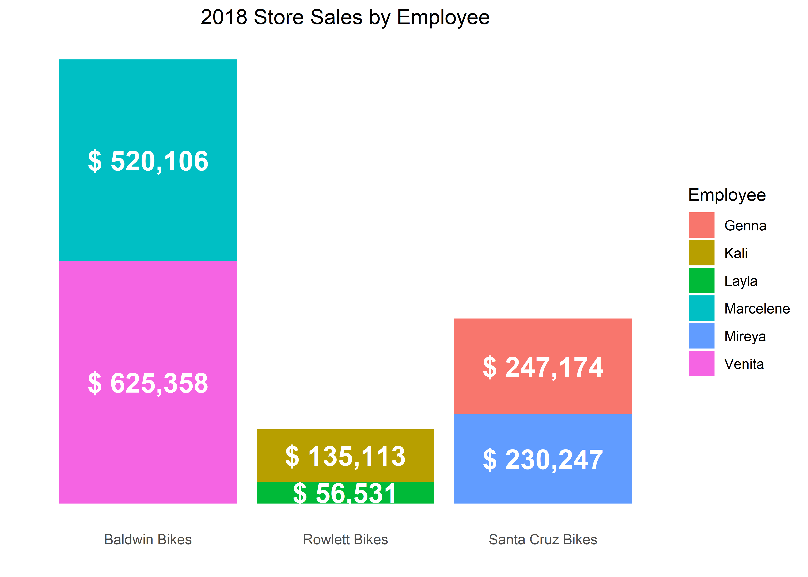
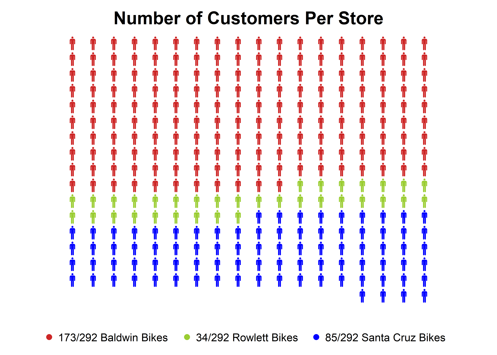
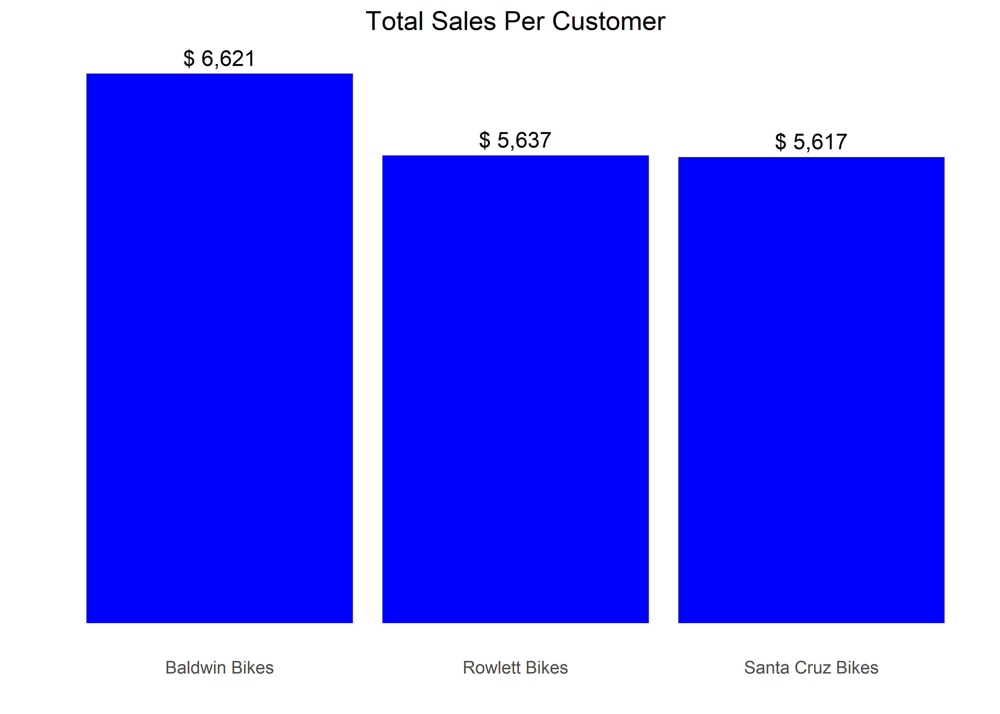
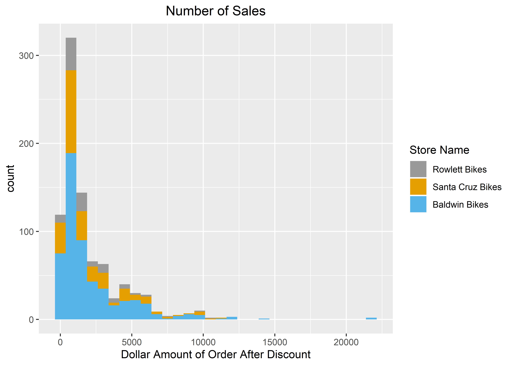
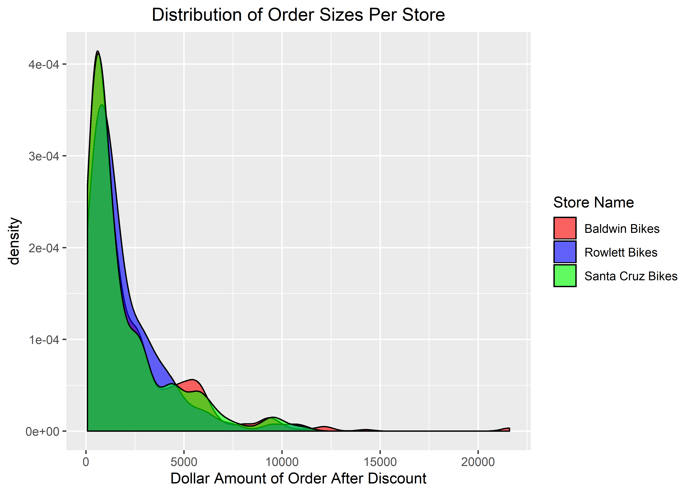

Revenue Analysis
================
Dustin Bowman

This is an analysis of data from three bike stores that seeks strategies to improve business sales and operations. Raw data:
<https://www.sqlservertutorial.net/sql-server-sample-database/>

``` r
# Load libraries
library(DBI)
library(RODBC)
library(tidyverse)
library(lubridate)
library(scales)
library(personograph)
library(dplyr)

# Set up SQL connection
con <- dbConnect(odbc::odbc(), "msSQL", timeout = 10)

dbGetQuery(con, 'USE bike_stores')
```

Breakdown total sales by brand

``` r
# Group data by brand
total_sales_brands <- dbGetQuery(con, "SELECT brand_name, 
                                              SUM(sales.order_items.list_price*quantity*(1-discount)) as total_sales 
                                       FROM production.brands   
                                       JOIN production.products
                                       ON production.brands.brand_id = production.products.brand_id
                                       JOIN sales.order_items 
                                       ON production.products.product_id = sales.order_items.product_id
                                       GROUP BY brand_name" )

total_sales_brands <- total_sales_brands[order(-total_sales_brands$total_sales),]

# Plot
total_sales_brands %>%
  ggplot(aes(reorder(brand_name, total_sales), total_sales)) +
  geom_bar(stat='identity', fill='blue') +
  xlab("Brands") + 
  geom_text(aes(label=paste('$',formatC(total_sales, big.mark=',', format = 'f', digits=0))), vjust=-.5) +
  ggtitle("Total Revenue By Brand") +
  theme(plot.title = element_text(hjust = 0.5),
        panel.grid.major = element_blank(),
        panel.background = element_blank(),
        axis.text.y = element_blank(), 
        axis.ticks = element_blank()) +
  ylab("") +
  xlab("")
```

<!-- -->

There is an obvious disparity between the highest selling brand, Trek,
and the lowest, Strider. Let’s investigate further to see why Strider
sales are so low.

``` r
# Pull order history for Strider
strider_orders <- dbGetQuery(con, "SELECT sales.orders.* 
                                   FROM production.brands 
                                   JOIN production.products
                                   ON production.brands.brand_id = production.products.brand_id
                                   JOIN sales.order_items 
                                   ON production.products.product_id = sales.order_items.product_id
                                   JOIN sales.orders
                                   ON sales.order_items.order_id = sales.orders.order_id
                                   WHERE brands.brand_name = 'Strider'")

print(strider_orders[order(strider_orders$order_date, decreasing=T),])
```

    ##    order_id customer_id order_status order_date required_date shipped_date
    ## 16     1591         165            2 2018-04-27    2018-04-27         <NA>
    ## 15     1583          44            1 2018-04-25    2018-04-25         <NA>
    ## 14     1573          24            2 2018-04-23    2018-04-23         <NA>
    ## 13     1556           4            2 2018-04-18    2018-04-18         <NA>
    ## 11     1519          26            2 2018-04-11    2018-04-11         <NA>
    ## 12     1520          66            2 2018-04-11    2018-04-11         <NA>
    ## 10     1494          69            2 2018-04-05    2018-04-05         <NA>
    ## 9      1476          35            4 2018-03-31    2018-04-01   2018-04-01
    ## 8      1462        1101            4 2018-03-22    2018-03-24   2018-03-24
    ## 7      1439         463            4 2018-03-15    2018-03-16   2018-03-17
    ## 6      1433        1142            4 2018-03-11    2018-03-13   2018-03-12
    ## 5      1425         126            4 2018-03-07    2018-03-09   2018-03-09
    ## 4      1415         839            4 2018-03-03    2018-03-04   2018-03-05
    ## 3      1409          21            4 2018-02-26    2018-02-28   2018-02-28
    ## 2      1379        1256            4 2018-02-02    2018-02-05   2018-02-05
    ## 1      1346         136            4 2018-01-14    2018-01-15   2018-01-15
    ##    store_id staff_id
    ## 16        1        2
    ## 15        2        6
    ## 14        1        2
    ## 13        2        6
    ## 11        2        7
    ## 12        3        8
    ## 10        1        3
    ## 9         2        7
    ## 8         2        6
    ## 7         2        7
    ## 6         2        7
    ## 5         2        6
    ## 4         2        7
    ## 3         3        8
    ## 2         2        6
    ## 1         3        8

We can now see that there are only 16 orders and that Strider has only
recently become available. Let’s instead look at average sales per month
of each brand to get a better indication of performance.

``` r
# Get monthly average sales for each brand
monthly_orders_df <- dbGetQuery(con, "SELECT  production.brands.brand_name, 
                                              sales.order_items.list_price,
                                              sales.order_items.quantity,
                                              sales.order_items.discount,
                                              sales.orders.order_date
                                      from production.brands 
                                      JOIN production.products
                                      ON production.brands.brand_id = production.products.brand_id
                                      JOIN sales.order_items 
                                      ON production.products.product_id = sales.order_items.product_id
                                      JOIN sales.orders
                                      ON sales.order_items.order_id = sales.orders.order_id" ) 

# Group data by month and find monthly avg
monthly_orders_df <- monthly_orders_df %>%
  group_by(brand_name, month=floor_date(as.Date(order_date), "month")) %>%
  summarize(amount=sum(list_price*quantity*(1-discount))) %>%
  group_by(brand_name) %>%
  summarize(monthly_avg=mean(amount))

# Join the monthly avg data with the total sales data
total_sales_brands <- left_join(total_sales_brands, monthly_orders_df)
```

    ## Joining, by = "brand_name"

``` r
total_sales_brands_tidy <- total_sales_brands %>% tidyr::pivot_longer(cols=c('total_sales', 'monthly_avg'), names_to='type', values_to="sales")

# plot the grouped bar plot
total_sales_brands_tidy %>%
  ggplot(aes(reorder(brand_name, sales), sales, fill = type)) +
  geom_bar(stat='identity', position='dodge') +
  coord_flip() +
  xlab("Brands") +
  scale_y_log10(breaks = trans_breaks("log10", function(x) 10^x),
                labels = trans_format("log10", math_format(10^.x))) +
  theme(plot.title = element_text(hjust = 0.5),
        plot.subtitle = element_text(hjust = 0.5),
        panel.grid.major.x = element_blank(),
        axis.ticks.x = element_blank()) +
  labs(title="Total Sales and Average Monthly Sales by Brand", x="", y="USD", fill='Sales') +
  scale_fill_manual(labels = c("Monthly Avg", "Total"), values = c("orange", "blue")) 
```

<!-- -->

Note the log scaled x axis. The monthly average sales fall in line with
the total sales and Strider remains the worst performer for total sales
and average monthly sales.

Next let’s analyze sales by category and gender.

``` r
# Get sales revenue grouped by gender
gender_categories_df <- dbGetQuery(con, "
WITH genders as 
  (SELECT product_id,
    CASE
      WHEN product_name LIKE '%women%' THEN 'female'
      WHEN product_name LIKE '%girl%' THEN 'female'
      ELSE 'male'
    END AS sex
FROM production.products)

SELECT category_name, genders.sex, SUM(sales.order_items.list_price*quantity*(1-discount)) as total_sales from
production.categories
JOIN production.products
ON production.categories.category_id = production.products.category_id
JOIN sales.order_items 
ON production.products.product_id = sales.order_items.product_id
JOIN genders
ON genders.product_id = production.products.product_id
GROUP BY category_name, genders.sex
           ")

gender_categories_df$total_sales <- as.integer(gender_categories_df$total_sales)
gender_categories_df$category_name <- str_replace(gender_categories_df$category_name, "Bicycles", "Bikes")

# Plot bar plot of category sales by gender
gender_categories_df %>%
  ggplot(aes(reorder(category_name, total_sales), total_sales, fill=sex)) +
  geom_bar(stat='identity', position='stack') +
  coord_flip() +
  labs(title = ("Revenue Aggregated by Gender and Category"), x="", y="") +
  scale_y_continuous(labels=dollar_format()) +
  theme(plot.title = element_text(hjust = 0.5),
        panel.grid.major.y = element_blank(),
        axis.ticks.y = element_blank())
```

<!-- --> The most
obvious takeaway is the underwhelming amount of female customers.
Perhaps some targeted marketing is in order. We also see that childrens
bike sales are lagging. Marketing may want to explore opportunities to
boost sales, perhaps starting a trade in program to graduate bikes for
families that don’t want to make many large purchases as their child
outgrows their bike.

Now let’s look at the employee data for individual stores.

``` r
# Find number of active employees for each store
dbGetQuery(con, "
           WITH employees_per_store as (
             SELECT store_id,
                    COUNT(staff_id) as num_employees
             FROM sales.staffs
             WHERE active != 0
             GROUP BY store_id
           )
           SELECT sales.stores.store_name,
                  num_employees
           FROM sales.stores 
           JOIN employees_per_store
           ON sales.stores.store_id = employees_per_store.store_id
           ")
```

    ##         store_name num_employees
    ## 1 Santa Cruz Bikes             4
    ## 2    Baldwin Bikes             3
    ## 3    Rowlett Bikes             3

``` r
# Get sales revenue grouped by employee
staff_sales_2018 <- dbGetQuery(con, "
           WITH staff_names_per_store as (
             SELECT sales.staffs.store_id as store_id,
                    store_name,
                    sales.staffs.staff_id as staff_id,
                    first_name
             FROM sales.staffs
             JOIN sales.stores
             ON sales.staffs.store_id = sales.stores.store_id
             WHERE active != 0
           ),
           staff_sales_2018 as (
             SELECT first_name,
                    SUM(quantity*list_price*(1-discount)) as sales_2018
             FROM staff_names_per_store
             JOIN sales.orders
             ON staff_names_per_store.staff_id = sales.orders.staff_id
             JOIN sales.order_items
             ON sales.orders.order_id = sales.order_items.order_id
             WHERE sales.orders.order_date >= '2018-01-01'
             GROUP BY first_name
           )
           SELECT staff_names_per_store.store_name,
                  staff_sales_2018.first_name,
                  staff_sales_2018.sales_2018
           FROM staff_names_per_store
           JOIN staff_sales_2018 ON staff_names_per_store.first_name = staff_sales_2018.first_name
           ")
# Plot staff sales for 2018
staff_sales_2018 %>% ggplot(aes(store_name, sales_2018, fill = first_name)) +
  geom_bar(stat='identity', position = 'stack') +
  geom_text(aes(label = paste('$',formatC(sales_2018, big.mark=',', format = 'f', digits=0)),
                fontface=2), 
            position = position_stack(vjust = .5),
            col='white', 
            size=6) +
  ggtitle("2018 Store Sales by Employee") +
  labs(x="", y="", fill = 'Employee') +
  theme_minimal() +
  scale_y_continuous(breaks = NULL) +
  theme(axis.text.y = element_blank(), 
        axis.ticks = element_blank(),
        plot.title = element_text(hjust = 0.5),
        panel.background = element_blank(),
        panel.grid.major.x = element_blank(),) 
```

<!-- -->

Here you can see sales revenue generated by the six sales associates.
Layla is underperforming compared to Kali at Rowlett Bikes while the
other employees seem to be reasonably competitive with each other based
on total revenue for their respective stores.

Let’s investigate Baldwin Bikes’ high revenue and see if it’s due to
more customers, higher sales per customer, or other factors.

``` r
# Get revenue for each store in 2018
store_revenues_df <- dbGetQuery(con, "
           SELECT stores.store_name, 
                  SUM(list_price*quantity*(1-discount)) as revenue_2018
           FROM sales.stores 
           JOIN sales.orders ON sales.stores.store_id=sales.orders.store_id
           JOIN sales.order_items ON sales.orders.order_id=sales.order_items.order_id
           WHERE sales.orders.order_date >= '2018-01-01'
           GROUP BY sales.stores.store_name
           ")

# Get number of customers for each store
num_customers_df <- dbGetQuery(con, "
           WITH num_customers_by_store as (
           SELECT store_id, COUNT(sales.customers.customer_id) as num_customers
           FROM sales.customers
           JOIN sales.orders ON sales.customers.customer_id = sales.orders.customer_id
           WHERE sales.orders.order_date >= '2018-01-01'
           GROUP BY store_id
           )
           SELECT store_name, num_customers
           FROM num_customers_by_store 
           JOIN sales.stores ON num_customers_by_store.store_id = sales.stores.store_id
           ")
sales_per_customer_df <- merge(num_customers_df, store_revenues_df)
sales_per_customer_df$sales_per_customer <- sales_per_customer_df$revenue_2018 / sales_per_customer_df$num_customers
total_customers = sum(sales_per_customer_df$num_customers)
sales_per_customer_df$customer_pct = sales_per_customer_df$num_customers/total_customers

# Plot customer personograph
personograph(data = list('Baldwin Bikes' = sales_per_customer_df[1, 'customer_pct'],
                         'Rowlett Bikes' = sales_per_customer_df[2, 'customer_pct'],
                         'Santa Cruz Bikes' = sales_per_customer_df[3, 'customer_pct']),
             fig.title = 'Number of Customers Per Store',
             n.icons = total_customers,
             colors = list('Baldwin Bikes' = 'firebrick3',
                           'Rowlett Bikes' = 'olivedrab3', 
                           'Santa Cruz Bikes' = 'blue'))
```

    ## Warning in grid.Call.graphics(C_text, as.graphicsAnnot(x$label), x$x,
    ## x$y, : font family not found in Windows font database

<!-- -->

``` r
# Plot sales revenue per customer
sales_per_customer_df %>%
  ggplot(aes(store_name, sales_per_customer)) +
  geom_bar(stat='identity', fill='blue') +
  xlab("Store") + 
  geom_text(aes(label=paste('$',formatC(sales_per_customer, big.mark=',', format = 'f', digits=0))), vjust=-.5) +
  ggtitle("Total Sales Per Customer") +
  theme(plot.title = element_text(hjust = 0.5),
        panel.grid.major = element_blank(),
        panel.background = element_blank(),
        axis.text.y = element_blank(), 
        axis.ticks = element_blank()) +
  ylab("") +
  xlab("")
```

<!-- -->

Baldwin Bikes not only pulls in much more customers than the other
stores, but also generates higher revenue per customer. We’d still like
to dive deeper to see what accounts for this success. Perhaps they are
using a different discounting strategy?

``` r
# Find the average discount rate used for each store
store_discounts_df <- dbGetQuery(con, "
           SELECT stores.store_name,
                  AVG(discount) as avg_discount_2018
           FROM sales.stores
           JOIN sales.orders ON sales.stores.store_id=sales.orders.store_id
           JOIN sales.order_items ON sales.orders.order_id=sales.order_items.order_id
           WHERE sales.orders.order_date >= '2018-01-01'
           GROUP BY sales.stores.store_name
           ")
print(store_discounts_df)
```

    ##         store_name avg_discount_2018
    ## 1 Santa Cruz Bikes          0.106182
    ## 2    Rowlett Bikes          0.094900
    ## 3    Baldwin Bikes          0.105390

Baldwin Bikes’ average discount rate falls in the middle of the three
stores. The takeaway is that they are likely not employing a
significantly different discount strategy. Is it possible they are
pushing customers to purchase more items at a time?

``` r
# Find the total number of items sold for each store
num_items_df <- dbGetQuery(con, "
           SELECT stores.store_name,
                  SUM(quantity) as num_items
           FROM sales.stores
           JOIN sales.orders ON sales.stores.store_id=sales.orders.store_id
           JOIN sales.order_items ON sales.orders.order_id=sales.order_items.order_id
           WHERE sales.orders.order_date >= '2018-01-01'
           GROUP BY sales.stores.store_name
           ")

# Find the average number of items sold to each customer
num_items_per_customer_df <- merge(num_items_df, num_customers_df)
num_items_per_customer_df$items_per_customer <- num_items_per_customer_df$num_items / num_items_per_customer_df$num_customers 
num_items_per_customer_df %>% 
  select(store_name, items_per_customer) %>% 
  print()
```

    ##         store_name items_per_customer
    ## 1    Baldwin Bikes           4.676301
    ## 2    Rowlett Bikes           4.382353
    ## 3 Santa Cruz Bikes           4.211765

In fact Baldwin Bikes is more likely to get repeat business from
customers, whether through active marketing or luck. Finally, is it
possible that they are just selling more expensive items?

``` r
# Prepare data for histogram
store_sales_distribution <- dbGetQuery(con, "
           SELECT store_name,
                  quantity*list_price*(1-discount) as net_sale
           FROM sales.stores
           JOIN sales.orders ON sales.stores.store_id = sales.orders.store_id
           JOIN sales.order_items ON sales.orders.order_id = sales.order_items.order_id
           WHERE order_date >= '2018/01/01'
           ")

# plot all three histograms together
store_sales_distribution %>% 
  ggplot() +
  geom_histogram(aes(net_sale, fill=factor(store_name, levels = c("Rowlett Bikes", "Santa Cruz Bikes", "Baldwin Bikes"))), binwidth=750) +
  ggtitle("Number of Sales") +
  labs(x="Dollar Amount of Order After Discount", fill='Store Name') +
  scale_fill_manual(values=c("#999999", "#E69F00", "#56B4E9")) +
  theme(plot.title = element_text(hjust = 0.5))
```

<!-- -->

Again, Baldwin Bikes excels at all price levels. Let’s adjust the
distribution to account for their high sales volume and see how their
sales vary for different price levels in relation to each store’s total
sales to gain better insight.

``` r
# Plot the three density plots together
store_sales_distribution %>% 
  ggplot() +
  geom_density(aes(net_sale, fill=store_name), alpha=.6) +
  ggtitle("Distribution of Order Sizes Per Store") +
  labs(x="Dollar Amount of Order After Discount", fill='Store Name') +
  theme(plot.title = element_text(hjust = 0.5)) +
  scale_fill_manual(values=c("red", "blue", "green"))
```

<!-- -->

The stores do have similar distributions, although Baldwin generates a
lot of revenue on orders in the $5,000-$7,000 range and $12,000+ range.

# Conclusion

Strider is off to a slow start. It may be worth considering some
promotion to spread brand awareness since their line is new. If monthly
average sales don’t see an uptick soon, consider dropping the line. Trek
is by far the stand out brand. Consider expanding the line by adding
more Trek products. Bike sales among women is extremely low. Any effort
put into boosting these sales will likely have a very good return. It
may also be worthwhile to make efforts to boost sales of childrens
bikes. Follow up on Layla’s low sales figure at Rowlett Bikes. Also
follow up with the two sales associates at Baldwin Bikes to see what
kind of strategies they’re employing to get more repeat business and how
they’re selling more big ticket items.
